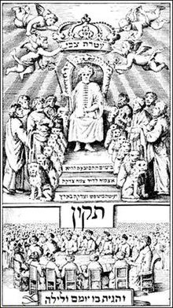

<h2 id="firstHeading" class="firstHeading" lang="en">Frankism</h2>

&nbsp;

<strong>Frankism</strong>&nbsp;was a&nbsp;<a class="mw-redirect" title="Sabbatean" href="https://en.wikipedia.org/wiki/Sabbatean">Sabbatean</a>&nbsp;Jewish religious movement of the 18th and 19th centuries,&nbsp;centered on the leadership of the&nbsp;<a class="mw-redirect" title="Jewish Messiah claimant" href="https://en.wikipedia.org/wiki/Jewish_Messiah_claimant">Jewish Messiah claimant</a>&nbsp;<a title="Jacob Frank" href="https://en.wikipedia.org/wiki/Jacob_Frank">Jacob Frank</a>, who lived from 1726 to 1791. Frank rejected religious norms, and said his followers were obligated to transgress as many moral boundaries as possible. At its height it claimed perhaps 500,000 followers, primarily&nbsp;<a title="Jews" href="https://en.wikipedia.org/wiki/Jews">Jews</a>&nbsp;living in&nbsp;<a title="Poland" href="https://en.wikipedia.org/wiki/Poland">Poland</a>&nbsp;and other parts of&nbsp;<a title="Eastern Europe" href="https://en.wikipedia.org/wiki/Eastern_Europe">Eastern Europe</a>.

&nbsp;

<h2>Description</h2>

Unlike traditional&nbsp;<a title="Judaism" href="https://en.wikipedia.org/wiki/Judaism">Judaism</a>, which provides a set of detailed guidelines called "<a title="Halakha" href="https://en.wikipedia.org/wiki/Halakha">halakha</a>" that are scrupulously followed by observant Jews and regulate many aspects of life,&nbsp;Frank claimed that "all laws and teachings will fall" and &ndash; following&nbsp;<a title="Antinomianism" href="https://en.wikipedia.org/wiki/Antinomianism">antinomianism</a>&nbsp;&ndash; asserted that the most important obligation of every person was the transgression of every boundary.

Frankism is associated with the&nbsp;<a title="Sabbateans" href="https://en.wikipedia.org/wiki/Sabbateans">Sabbateans</a>&nbsp;of Turkey, a religious movement that identified the 17th-century Jewish rabbi&nbsp;<a title="Sabbatai Zevi" href="https://en.wikipedia.org/wiki/Sabbatai_Zevi">Sabbatai Zevi</a>&nbsp;as the&nbsp;<a title="Messiah in Judaism" href="https://en.wikipedia.org/wiki/Messiah_in_Judaism">Messiah</a>.&nbsp;Like Frankism, the earlier forms of Sabbateanism believed that at least in some circumstances,&nbsp;<a title="Antinomianism" href="https://en.wikipedia.org/wiki/Antinomianism">antinomianism</a>&nbsp;was the correct path.&nbsp;Zevi himself would perform actions that violated traditional Jewish taboos, such as eating foods that were forbidden by&nbsp;<a title="Kashrut" href="https://en.wikipedia.org/wiki/Kashrut">kashrut</a>&nbsp;(Jewish dietary laws) and celebrating prescribed fast days as feast days.&nbsp;Especially after Zevi's death, a number of branches of Sabbateanism evolved, which disagreed among themselves over which aspects of traditional Judaism should be preserved and which discarded.&nbsp;The more radical branches even engaged in sexual foreplay. In Frankism,&nbsp;<a title="Orgy" href="https://en.wikipedia.org/wiki/Orgy">orgies</a>&nbsp;featured prominently in ritual.

Several authorities on Sabbateanism, including&nbsp;<a title="Heinrich Graetz" href="https://en.wikipedia.org/wiki/Heinrich_Graetz">Heinrich Graetz</a>&nbsp;and Aleksander Kraushar, were skeptical of the existence of such a thing as a distinctive "Frankist" doctrine. According to&nbsp;<a title="Gershom Scholem" href="https://en.wikipedia.org/wiki/Gershom_Scholem">Gershom Scholem</a>, another authority on Sabbateanism, Kraushar had described Frank's sayings as "grotesque, comical and incomprehensible". In his classic essay "Redemption Through Sin", Scholem argued a different position, seeing Frankism as a later and more radical outgrowth of Sabbateanism.&nbsp;In contrast,&nbsp;<a title="Jay Michaelson" href="https://en.wikipedia.org/wiki/Jay_Michaelson">Jay Michaelson</a>&nbsp;argues that Frankism was "an original theology that was innovative, if sinister" and was in many respects a departure from the earlier formulations of Sabbateanism. In traditional Sabbatean doctrine, Zevi &ndash; and often his followers &ndash; claimed to be able to liberate the sparks of holiness hidden within what seemed to be evil. According to Michaelson, Frank's theology asserted that the attempt to liberate the sparks of holiness was the problem, not the solution. Rather, Frank claimed that the "mixing" between holy and unholy was virtuous.&nbsp;<a class="new" title="Netanel Lederberg (page does not exist)" href="https://en.wikipedia.org/w/index.php?title=Netanel_Lederberg&amp;action=edit&amp;redlink=1">Netanel Lederberg</a>&nbsp;claims that Frank had a&nbsp;<a title="Gnosticism" href="https://en.wikipedia.org/wiki/Gnosticism">Gnostic</a>&nbsp;philosophy wherein there was a "true God" whose existence was hidden by a "false God". This "true God" could allegedly only be revealed through a total destruction of the social and religious structures created by the "false God", thus leading to a thorough antinomianism. For Frank, the very distinction between good and evil is a product of a world governed by the "false God". Lederberg compares Frank's position to that of&nbsp;<a title="Friedrich Nietzsche" href="https://en.wikipedia.org/wiki/Friedrich_Nietzsche">Friedrich Nietzsche</a>.

<h2>After Jacob Frank</h2>

After Jacob Frank's death in 1791, his daughter&nbsp;<a title="Eve Frank" href="https://en.wikipedia.org/wiki/Eve_Frank">Eve</a>, who had been declared in 1770 to be the incarnation of the&nbsp;<a title="Shekhinah" href="https://en.wikipedia.org/wiki/Shekhinah">Shekhinah</a>, the dwelling of the&nbsp;<a title="Divine presence" href="https://en.wikipedia.org/wiki/Divine_presence">divine presence</a>, continued to lead the movement with her brothers.

 
<h2 id="firstHeading" class="firstHeading" lang="en">Sabbateanism</h2>

&nbsp;

<table class="vertical-navbox nowraplinks hlist">
<tbody>
<tr>
<th><a title="Jews" href="https://en.wikipedia.org/wiki/Jews">Jews</a>&nbsp;and&nbsp;<a title="Judaism" href="https://en.wikipedia.org/wiki/Judaism">Judaism</a></th>
</tr>
<tr>
<td>
<ul>
<li><a title="Jew (word)" href="https://en.wikipedia.org/wiki/Jew_(word)">Etymology</a></li>
<li><a title="Who is a Jew?" href="https://en.wikipedia.org/wiki/Who_is_a_Jew%3F">Who is a Jew?</a></li>
</ul>
</td>
</tr>
<tr>
<td>

<a title="Judaism" href="https://en.wikipedia.org/wiki/Judaism">Religion</a>

</td>
</tr>
<tr>
<td>

<a title="Category:Jewish texts" href="https://en.wikipedia.org/wiki/Category:Jewish_texts">Texts</a>

</td>
</tr>
<tr>
<td>

<a title="Jewish ethnic divisions" href="https://en.wikipedia.org/wiki/Jewish_ethnic_divisions">Communities</a>

</td>
</tr>
<tr>
<td>

<a title="Jewish population by country" href="https://en.wikipedia.org/wiki/Jewish_population_by_country">Population</a>

</td>
</tr>
<tr>
<td>

<a title="Jewish religious movements" href="https://en.wikipedia.org/wiki/Jewish_religious_movements">Denominations</a>

</td>
</tr>
<tr>
<td>

<a title="Jewish culture" href="https://en.wikipedia.org/wiki/Jewish_culture">Culture</a>

</td>
</tr>
<tr>
<td>

<a title="Jewish languages" href="https://en.wikipedia.org/wiki/Jewish_languages">Languages</a>

</td>
</tr>
<tr>
<td>

<a title="Jewish history" href="https://en.wikipedia.org/wiki/Jewish_history">History</a>

</td>
</tr>
<tr>
<td>

<a title="Jewish political movements" href="https://en.wikipedia.org/wiki/Jewish_political_movements">Politics</a>

</td>
</tr>
<tr>
<td>
<ul>
<li><a title="Category:Jews and Judaism" href="https://en.wikipedia.org/wiki/Category:Jews_and_Judaism">Category</a></li>
<li><a title="Portal:Judaism" href="https://en.wikipedia.org/wiki/Portal:Judaism">Portal</a></li>
</ul>
</td>
</tr>
</tbody>
</table>

&nbsp;

The&nbsp;<strong>Sabbateans</strong>&nbsp;(or&nbsp;<strong>Sabbatians</strong>) were a variety of followers of disciples and believers in&nbsp;<a title="Sabbatai Zevi" href="https://en.wikipedia.org/wiki/Sabbatai_Zevi">Sabbatai Zevi</a>&nbsp;(1626&ndash;1676), a&nbsp;<a class="mw-redirect" title="Jew" href="https://en.wikipedia.org/wiki/Jew">Jewish</a>&nbsp;<a title="Rabbi" href="https://en.wikipedia.org/wiki/Rabbi">rabbi</a>&nbsp;who was proclaimed to be the&nbsp;<a class="mw-redirect" title="Jewish Messiah" href="https://en.wikipedia.org/wiki/Jewish_Messiah">Jewish Messiah</a>&nbsp;in 1666 by&nbsp;<a title="Nathan of Gaza" href="https://en.wikipedia.org/wiki/Nathan_of_Gaza">Nathan of Gaza</a>. Vast numbers of Jews in the&nbsp;<a title="Jewish diaspora" href="https://en.wikipedia.org/wiki/Jewish_diaspora">Jewish diaspora</a>&nbsp;accepted his claims, even after he became a&nbsp;<a title="Apostasy" href="https://en.wikipedia.org/wiki/Apostasy#Judaism">Jewish apostate</a>&nbsp;with his&nbsp;<a title="Sabbatai Zevi" href="https://en.wikipedia.org/wiki/Sabbatai_Zevi#Sabbatai_adopts_Islam">conversion to Islam</a>&nbsp;in the same year. Sabbatai Zevi's followers, both during his "Messiahship" and after his conversion to Islam, are known as Sabbateans. They can be divided into three groups:&nbsp;<em>Maaminim</em>&nbsp;(believers),&nbsp;<em>Haberim</em>&nbsp;(associates), and&nbsp;<em>Ba'ale Milhamah</em>&nbsp;(warriors).

Part of the Sabbateans lived on until well into the 20th century as&nbsp;<a title="D&ouml;nmeh" href="https://en.wikipedia.org/wiki/D%C3%B6nmeh">D&ouml;nmeh</a>.

&nbsp;

<h2>Sabbateans who remained Jews</h2>

&nbsp;

&nbsp;

Sabbatai Zevi "enthroned" as the&nbsp;<a class="mw-redirect" title="Jewish Messiah" href="https://en.wikipedia.org/wiki/Jewish_Messiah">Jewish Messiah</a>, from&nbsp;<em>Tikkun</em>, Amsterdam, 1666.

  

In&nbsp;<a title="Jewish history" href="https://en.wikipedia.org/wiki/Jewish_history">Jewish history</a>&nbsp;many Jews after Sabbatai Zvi's apostasy, although horrified, clung to the belief that Zvi could still be regarded as the true Jewish messiah.&nbsp;They constituted the largest number of Sabbateans during the seventeenth and eighteenth centuries. By the nineteenth century Jewish Sabbateans had been reduced to small groups of hidden followers who feared being discovered for their beliefs that were deemed to be entirely heretical and antithetical to classical Judaism. These very Jews fell under the category of Sectarian Sabbateans which was born when many Sabbateans refused to accept that Zvi's apostasy might have been indicative of the fact that their faith was genuinely an illusion.

Another large group of Sabbateans succeeding the apostasy began to view Islam in an extremely negative light.&nbsp;Polemics against Islam erupted directly after Zvi's conversion. Some of these attacks were considered part of a largely Anti-Sabbatean agenda.&nbsp;Accusations coming from Anti-Sabbateans revolved around the idea that Sabbatai Zvi's conversion to Islam was rightfully an indicator of a false claim of messianism.

<h2>Sabbatai Zevi's conversion to Islam</h2>

Jewish historians&nbsp;have stated that it is hard to describe the national sense of shock and trauma that set in when the masses of Jews all over the world learned that someone as famous as Sabbatai Zevi had officially abandoned his faith for Islam. However, the fact remains that Zevi is the most famous Jew to have become a Muslim, which is also what the term Sabbatean has come to denote. Many within Zevi's inner circle followed him into Islam, including his wife&nbsp;<a title="Sabbatai Zevi" href="https://en.wikipedia.org/wiki/Sabbatai_Zevi#Marriage_to_Sarah">Sarah</a>&nbsp;and most of his closest relatives and friends.&nbsp;<a title="Nathan of Gaza" href="https://en.wikipedia.org/wiki/Nathan_of_Gaza">Nathan of Gaza</a>, the scholar closest to Zevi, who had caused Zevi to reveal his Messiahship and in turn became his prophet, never followed his master into Islam but remained a Jew, albeit excommunicated by his Jewish brethren.

<h2>Sabbatean &ndash; Sufi similarities</h2>

Claims of ties between Sabbatean Kabbalah and&nbsp;<a title="Sufism" href="https://en.wikipedia.org/wiki/Sufism">Sufism</a>&nbsp;go back to the days of Sabbatai Zevi.[2]&nbsp;This is largely based on the contention that Zevi's exile in the Balkans brought him into close contact with several forms of unorthodox Sufism which existed in the region. The D&ouml;nme community of Salonika came to play a significant role in the Sufi life of the region and its members actively involved with a number of Sufi orders, particularly the Mevlevi. Some alleged similarities between D&ouml;nme and unorthodox Sufi practice seem&nbsp;to exist, including the violation of&nbsp;<em>kashrut/halal</em>, sexual license, ecstatic singing, mystical interpretations of sacred scripture, and the practice of ritual meals. However, confirmed direct ties between Sabbatai Zevi and any Sufi order are conjectural and hearsay. The often claimed connection between the movement and&nbsp;<a title="Bektashi Order" href="https://en.wikipedia.org/wiki/Bektashi_Order">Bektashi Sufism</a>&nbsp;relies merely on circumstantial evidence and coincidence rather than any concrete substantiation. During Zevi's lifetime the Bektashi order had yet to attain widespread popularity in the Balkans; it came to dominate southern Albania only in the late 19th century. Nevertheless, there were a number of other heterodox Sufi movements in the region in the mid-17th century, including the Hamzevis, Melamis and Qalandars.

<h3>The D&ouml;nme</h3>

Inside the&nbsp;<a title="Ottoman Empire" href="https://en.wikipedia.org/wiki/Ottoman_Empire">Ottoman Empire</a>, those followers of Zevi who had converted to&nbsp;<a title="Islam" href="https://en.wikipedia.org/wiki/Islam">Islam</a>&nbsp;but who secretly continued Jewish observances and&nbsp;<a class="mw-redirect" title="Brit Mila" href="https://en.wikipedia.org/wiki/Brit_Mila">Brit Mila</a>&nbsp;became known as the&nbsp;<em>D&ouml;nme</em>&nbsp;(<a title="Turkish language" href="https://en.wikipedia.org/wiki/Turkish_language">Turkish</a>:&nbsp;<em lang="tr">d&ouml;nme</em>&nbsp;"convert").

<h2>Sabbatean-related controversies in Jewish history</h2>

&nbsp;

<table class="vertical-navbox nowraplinks">
<tbody>
<tr>
<th><a title="Jewish mysticism" href="https://en.wikipedia.org/wiki/Jewish_mysticism">Jewish mysticism</a></th>
</tr>
<tr>
<td>

Forms

<table>
<tbody>
<tr>
<td><a title="Nevi'im" href="https://en.wikipedia.org/wiki/Nevi%27im">Prophets</a></td>
<td>800&ndash;400s BCE</td>
</tr>
<tr>
<td><a title="Apocalyptic literature" href="https://en.wikipedia.org/wiki/Apocalyptic_literature">Apocalyptic literature</a></td>
<td>300&ndash;100 BCE</td>
</tr>
<tr>
<td>

<ul>
<li><a title="Pardes (legend)" href="https://en.wikipedia.org/wiki/Pardes_(legend)">Pardes</a></li>
<li><a title="Maaseh Breishit and Maaseh Merkavah" href="https://en.wikipedia.org/wiki/Maaseh_Breishit_and_Maaseh_Merkavah">Rabbinic esotericism</a></li>
</ul>

</td>
<td>c. 1&ndash;200 CE</td>
</tr>
<tr>
<td><a title="Merkabah mysticism" href="https://en.wikipedia.org/wiki/Merkabah_mysticism">Merkabah</a>-<a title="Hekhalot literature" href="https://en.wikipedia.org/wiki/Hekhalot_literature">Hekhalot</a></td>
<td>c. 100 BCE&ndash;1000 CE</td>
</tr>
<tr>
<td><a title="Practical Kabbalah" href="https://en.wikipedia.org/wiki/Practical_Kabbalah">Practical Kabbalah</a></td>
<td>early CE-modernity</td>
</tr>
<tr>
<td><a title="Sefer Yetzirah" href="https://en.wikipedia.org/wiki/Sefer_Yetzirah">Sefer Yetzirah</a></td>
<td>200&ndash;600 CE</td>
</tr>
<tr>
<td><a class="mw-redirect" title="Chassidei Ashkenaz" href="https://en.wikipedia.org/wiki/Chassidei_Ashkenaz">Chassidei Ashkenaz</a></td>
<td>c. 1150&ndash;1250 CE</td>
</tr>
<tr>
<td>

<ul>
<li><a title="Kabbalah" href="https://en.wikipedia.org/wiki/Kabbalah">Medieval Kabbalah</a></li>
<li><a title="Abraham Abulafia" href="https://en.wikipedia.org/wiki/Abraham_Abulafia">Ecstatic Kabbalah</a></li>
</ul>

</td>
<td>c. 1175&ndash;1500s CE</td>
</tr>
<tr>
<td><a title="Zohar" href="https://en.wikipedia.org/wiki/Zohar">Zohar</a></td>
<td>1280s-1400s CE</td>
</tr>
<tr>
<td><a title="Moses ben Jacob Cordovero" href="https://en.wikipedia.org/wiki/Moses_ben_Jacob_Cordovero">Cordoverian Kabbalah</a></td>
<td>1500s CE</td>
</tr>
<tr>
<td><a title="Lurianic Kabbalah" href="https://en.wikipedia.org/wiki/Lurianic_Kabbalah">Lurianic Kabbalah</a></td>
<td>1570 CE&ndash;today</td>
</tr>
<tr>
<td><a class="mw-selflink selflink">Sabbatean sects</a></td>
<td>1665&ndash;c. 1800 CE</td>
</tr>
<tr>
<td>

<ul>
<li><a title="Hasidic Judaism" href="https://en.wikipedia.org/wiki/Hasidic_Judaism">Hasidism</a></li>
<li><a class="mw-redirect" title="Hasidic thought" href="https://en.wikipedia.org/wiki/Hasidic_thought">Hasidic schools</a></li>
</ul>

</td>
<td>1730s CE&ndash;today</td>
</tr>
<tr>
<td><a title="" href="https://en.wikipedia.org/wiki/List_of_Jewish_mysticism_scholars">Academic study</a></td>
<td>c. 1920s&ndash;today</td>
</tr>
</tbody>
</table>

</td>
</tr>
</tbody>
</table>

&nbsp;

<h3>The Emden-Eybeschutz controversy</h3>

The&nbsp;<a title="Jacob Emden" href="https://en.wikipedia.org/wiki/Jacob_Emden#The_Emden-Eybesch.C3.BCtz_Controversy">Emden-Eybeschutz controversy</a>&nbsp;was a serious rabbinical disputation with wider political ramifications in Europe that followed the accusations by Rabbi&nbsp;<a title="Jacob Emden" href="https://en.wikipedia.org/wiki/Jacob_Emden">Jacob Emden</a>&nbsp;(1697&ndash;1776) who was a fierce opponent of the Sabbateans, against Rabbi&nbsp;<a title="Jonathan Eybeschutz" href="https://en.wikipedia.org/wiki/Jonathan_Eybeschutz">Jonathan Eybeschutz</a>&nbsp;(1690&ndash;1764) whom he accused of being a secret Sabbatean.

The Emden-Eybeschutz controversy arose concerning the&nbsp;<a title="Amulet" href="https://en.wikipedia.org/wiki/Amulet">amulets</a>&nbsp;which Emden suspected Eybeschutz of issuing. It was alleged that these amulets recognized the messianic claims of Sabbatai Zevi.&nbsp;Emden then accused Eybeschutz of heresy. Emden was known for his attacks directed against the adherents, or those he supposed to be adherents, of Sabbatai Zevi. In Emden's eyes, Eybeschutz was a convicted Sabbatean.&nbsp;The controversy lasted several years, continuing even after Eybeschutz's death.

Emden's assertion of&nbsp;<a title="Heresy" href="https://en.wikipedia.org/wiki/Heresy#Heresy_in_Judaism">heresy</a>&nbsp;was chiefly based on the interpretation of some&nbsp;<a title="Amulet" href="https://en.wikipedia.org/wiki/Amulet">amulets</a>&nbsp;prepared by Eybeschutz, in which Emden professed to see Sabbatean allusions. Hostilities began before Eybeschutz left&nbsp;<a title="Prague" href="https://en.wikipedia.org/wiki/Prague">Prague</a>; when Eybeschutz was named chief rabbi of the three communities of Altona,&nbsp;<a title="Hamburg" href="https://en.wikipedia.org/wiki/Hamburg">Hamburg</a>, and&nbsp;<a title="Wandsbek" href="https://en.wikipedia.org/wiki/Wandsbek">Wandsbek</a>&nbsp;(1751), the controversy reached the stage of intense and bitter antagonism. Emden maintained that he was at first prevented by threats from publishing anything against Eybeschutz. He solemnly declared in his synagogue the writer of the amulets to be a Sabbathean heretic and deserving of&nbsp;<em><a title="Herem (censure)" href="https://en.wikipedia.org/wiki/Herem_(censure)">cherem</a></em>&nbsp;(<a title="Excommunication" href="https://en.wikipedia.org/wiki/Excommunication">excommunication</a>).

The majority of the rabbis in Poland, Moravia, and Bohemia, as well as the leaders of the Three Communities, supported Eybeschutz:&nbsp;the accusation was "utterly incredible" - in 1725, Eybeschutz was among the&nbsp;<a title="Prague" href="https://en.wikipedia.org/wiki/Prague">Prague</a>&nbsp;rabbis who excommunicated the Sabbatean sect.&nbsp;(Others&nbsp;suggest that the rabbis issued this ruling because they feared the repercussions if their leading figure was found to be a Sabbatean).

The controversy was a momentous incident in&nbsp;<a title="Jewish history" href="https://en.wikipedia.org/wiki/Jewish_history">Jewish history</a>&nbsp;of the period, involving both Rabbi&nbsp;<a title="Yechezkel Landau" href="https://en.wikipedia.org/wiki/Yechezkel_Landau">Yechezkel Landau</a>&nbsp;and the&nbsp;<a title="Vilna Gaon" href="https://en.wikipedia.org/wiki/Vilna_Gaon">Vilna Gaon</a>, and may be credited with having crushed the lingering belief in Sabbatai current even in some Orthodox circles. In 1760 the quarrel broke out once more when some Sabbatean elements were discovered among the students of Eybeschutz'&nbsp;<em><a class="mw-redirect" title="Yeshivah" href="https://en.wikipedia.org/wiki/Yeshivah">yeshivah</a></em>. At the same time his younger son, Wolf, presented himself as a Sabbatean prophet, with the result that the&nbsp;<em>yeshivah</em>&nbsp;was closed.

<h3>Sabbateans and early Hasidism</h3>

Some scholars see seeds of the Hasidic movement within the Sabbatean movement.&nbsp;When Hasidism began to spread its influence, a serious schism evolved between the&nbsp;<a title="Hasidic Judaism" href="https://en.wikipedia.org/wiki/Hasidic_Judaism">Hasidic</a>&nbsp;and non-Hasidic Jews. Those who rejected the Hasidic movement dubbed themselves as&nbsp;<em><a title="Misnagdim" href="https://en.wikipedia.org/wiki/Misnagdim">misnagdim</a></em>&nbsp;("opponents").

Critics of Hasidic Judaism&nbsp;expressed concern that Hasidism might become a messianic sect as had occurred among the followers of both&nbsp;<a title="Sabbatai Zevi" href="https://en.wikipedia.org/wiki/Sabbatai_Zevi">Sabbatai Zevi</a>&nbsp;and&nbsp;<a title="Jacob Frank" href="https://en.wikipedia.org/wiki/Jacob_Frank">Jacob Frank</a>. However the&nbsp;<a title="Baal Shem Tov" href="https://en.wikipedia.org/wiki/Baal_Shem_Tov">Baal Shem Tov</a>, the founder of Hasidism, came at a time when the Jewish masses of Eastern Europe were reeling in bewilderment and disappointment engendered by the two Jewish&nbsp;<a class="mw-redirect" title="False messiah" href="https://en.wikipedia.org/wiki/False_messiah">false messiahs</a>&nbsp;Sabbatai Zevi (1626&ndash;1676) and Jacob Frank (1726&ndash;1791) in particular.

<h3>Sabbateans and modern secularism</h3>

Some scholars have noted that the Sabbatean movement in general fostered and connected well with the principles of modern&nbsp;<a title="Secularism" href="https://en.wikipedia.org/wiki/Secularism">secularism</a>.&nbsp;Related to this is the drive of the&nbsp;<a class="mw-redirect" title="Donmeh" href="https://en.wikipedia.org/wiki/Donmeh">Donmeh</a>&nbsp;in Turkey for secularizing their society just as European Jews promoted the values of&nbsp;<a title="Age of Enlightenment" href="https://en.wikipedia.org/wiki/Age_of_Enlightenment">Age of Enlightenment</a>&nbsp;and its Jewish equivalent the&nbsp;<em><a title="Haskalah" href="https://en.wikipedia.org/wiki/Haskalah">haskalah</a></em>.

<h2>Disillusioned Jewish Sabbateans</h2>

&nbsp;

Sabbatai's conversion to Islam was extremely disheartening for the world's Jewish communities. Among the masses of the people the greatest confusion reigned. In addition to the misery and disappointment from within, Muslims and Christians jeered at and scorned the credulous and duped Jews.&nbsp;In spite of Sabbatai's apostasy, many of his adherents still tenaciously clung to him, claiming that his conversion was a part of the Messianic scheme.&nbsp;This belief was further upheld and strengthened by the likes of Nathan of Gaza and&nbsp;<a title="Samuel Primo" href="https://en.wikipedia.org/wiki/Samuel_Primo">Samuel Primo</a>, who were interested in maintaining the movement.

<h2>Rabbis who opposed the Sabbateans</h2>
<h3>Joseph Escapa</h3>

Rabbi&nbsp;<a title="Joseph Escapa" href="https://en.wikipedia.org/wiki/Joseph_Escapa">Joseph Escapa</a>&nbsp;(1572&ndash;1662) was especially known for having been the teacher of Zevi and for having afterward excommunicated him.

<h3>Aaron Lapapa</h3>

Rabbi&nbsp;<a title="Aaron Lapapa" href="https://en.wikipedia.org/wiki/Aaron_Lapapa">Aaron Lapapa</a>&nbsp;(1590&ndash;1674) was the rabbi at&nbsp;<a title="Smyrna" href="https://en.wikipedia.org/wiki/Smyrna">Smyrna</a>&nbsp;in 1665, when Zevi's movement was at its height there. He was one of the few rabbis who had the courage to oppose the false prophet and&nbsp;<a class="mw-redirect" title="Excommunicate" href="https://en.wikipedia.org/wiki/Excommunicate">excommunicate</a>&nbsp;him. Zevi and his adherents retorted by deposing him and forcing him to leave the city, and his office was given to his colleague, Hayyim Benveniste, at that time one of Sabbatai's followers. After Sabbatai's conversion to&nbsp;<a title="Islam" href="https://en.wikipedia.org/wiki/Islam">Islam</a>, Lapapa seems to have been reinstated.

<h3>Jacob Hagis</h3>

Rabbi&nbsp;<a class="mw-redirect" title="Jacob Hagis" href="https://en.wikipedia.org/wiki/Jacob_Hagis">Jacob Hagis</a>&nbsp;(1620&ndash;1674) was one of Zevi's chief opponents, who put him under the&nbsp;<a title="Herem (censure)" href="https://en.wikipedia.org/wiki/Herem_(censure)">ban</a>. About 1673 Hagis went to&nbsp;<a title="Constantinople" href="https://en.wikipedia.org/wiki/Constantinople">Constantinople</a>&nbsp;to publish his&nbsp;<em>Lehem ha-Panim,</em>&nbsp;but he died there before this was accomplished. This book, as well as many others of his, was lost.

<h3>Moses Hagiz</h3>

Rabbi&nbsp;<a title="Moses Hagiz" href="https://en.wikipedia.org/wiki/Moses_Hagiz">Moses Hagiz</a>&nbsp;(1671- c. 1750) was born in&nbsp;<a title="Jerusalem" href="https://en.wikipedia.org/wiki/Jerusalem">Jerusalem</a>&nbsp;and waged a campaign against&nbsp;<a class="mw-redirect" title="Sabbatean" href="https://en.wikipedia.org/wiki/Sabbatean">Sabbatean</a>&nbsp;emissaries during 1725-1726.

<h3>Jacob ben Aaron Sasportas</h3>

Rabbi&nbsp;<a title="Jacob ben Aaron Sasportas" href="https://en.wikipedia.org/wiki/Jacob_ben_Aaron_Sasportas">Jacob ben Aaron Sasportas</a>&nbsp;(1610&ndash;1698) was one of the fiercest opponents of the Sabbatean movement. He wrote many letters to various communities in Europe, Asia, and Africa, exhorting them to unmask the impostors and to warn the people against them. He documented his struggle in his book&nbsp;<em>Tzitzat Novel Tzvi</em>, the title being based on Isaiah 28:4. He wrote a number of works, such as&nbsp;<em>Toledot Ya'akob</em>&nbsp;(1652), an index of Biblical passages found in the&nbsp;<em>haggadah</em>&nbsp;of the&nbsp;<a title="Jerusalem Talmud" href="https://en.wikipedia.org/wiki/Jerusalem_Talmud">Jerusalem Talmud</a>, similar to Aaron Pesaro's&nbsp;<em>Toledot Aharon</em>, which relates to the Babylonian&nbsp;<a title="Talmud" href="https://en.wikipedia.org/wiki/Talmud">Talmud</a>&nbsp;only; and&nbsp;<em>Ohel Ya'akov</em>&nbsp;(1737), a volume of halachik responsa which includes polemical correspondence against Zevi and his followers.

<h3>David Nieto</h3>

Rabbi&nbsp;<a title="David Nieto" href="https://en.wikipedia.org/wiki/David_Nieto">David Nieto</a>&nbsp;(1654&ndash;1728) was the&nbsp;<em><a title="Hakham" href="https://en.wikipedia.org/wiki/Hakham">haham</a></em>&nbsp;of the&nbsp;<a title="Spanish and Portuguese Jews" href="https://en.wikipedia.org/wiki/Spanish_and_Portuguese_Jews">Spanish and Portuguese Jewish</a>&nbsp;community in&nbsp;<a title="London" href="https://en.wikipedia.org/wiki/London">London</a>. He waged war untiringly on the Sabbateans, which he regarded as dangerous to the best interests of Judaism, and in this connection wrote his&nbsp;<em>Esh Dat</em>&nbsp;(London, 1715) against&nbsp;<a title="Nehemiah Hayyun" href="https://en.wikipedia.org/wiki/Nehemiah_Hayyun">Nehemiah Hayyun</a>&nbsp;(who supported Zevi).

<h3>Tzvi Ashkenazi</h3>

Rabbi&nbsp;<a title="Tzvi Ashkenazi" href="https://en.wikipedia.org/wiki/Tzvi_Ashkenazi">Tzvi Ashkenazi</a>&nbsp;(1656&ndash;1718) known as the&nbsp;<em>Chacham Tzvi</em>, for some time&nbsp;<a title="Rabbi" href="https://en.wikipedia.org/wiki/Rabbi">rabbi</a>&nbsp;of&nbsp;<a title="Amsterdam" href="https://en.wikipedia.org/wiki/Amsterdam">Amsterdam</a>, was a resolute opponent of the followers of Sabbatai Zevi. In Salonica he also witnessed the impact of the&nbsp;<a title="Sabbatai Zevi" href="https://en.wikipedia.org/wiki/Sabbatai_Zevi">Sabbatai Zevi</a>&nbsp;movement on the community, and this experience became a determining factor in his whole career. His son&nbsp;<a title="Jacob Emden" href="https://en.wikipedia.org/wiki/Jacob_Emden">Jacob Emden</a>&nbsp;served as rabbi in&nbsp;<a title="Emden" href="https://en.wikipedia.org/wiki/Emden">Emden</a>&nbsp;and followed in his father's footsteps in combating the Sabbatean movement.

<h3>Jacob Emden</h3>

Rabbi&nbsp;<a title="Jacob Emden" href="https://en.wikipedia.org/wiki/Jacob_Emden">Jacob Emden</a>&nbsp;(1697&ndash;1776) was&nbsp;<a title="Talmud" href="https://en.wikipedia.org/wiki/Talmud">Talmudic</a>&nbsp;scholar and leading opponent of the&nbsp;<a title="Sabbatai Zevi" href="https://en.wikipedia.org/wiki/Sabbatai_Zevi">Sabbatians</a>. He is best known as the opponent of Rabbi&nbsp;<a title="Jonathan Eybeschutz" href="https://en.wikipedia.org/wiki/Jonathan_Eybeschutz">Jonathan Eybeschutz</a>&nbsp;whom he accused of being a Sabbatean during&nbsp;<a title="Jacob Emden" href="https://en.wikipedia.org/wiki/Jacob_Emden#Emden-Eybesch%C3%BCtz_controversy">The Emden-Eybesch&uuml;tz Controversy</a>.

<h3>Naphtali Cohen</h3>

Rabbi&nbsp;<a title="Naphtali Cohen" href="https://en.wikipedia.org/wiki/Naphtali_Cohen">Naphtali Cohen</a>&nbsp;(1649&ndash;1718) was a&nbsp;<a class="mw-redirect" title="Kabbalist" href="https://en.wikipedia.org/wiki/Kabbalist">kabbalist</a>&nbsp;who was tricked into giving an&nbsp;<a title="Approbation" href="https://en.wikipedia.org/wiki/Approbation">approbation</a>&nbsp;to a book by the Sabbatean&nbsp;<a title="Nehemiah Hayyun" href="https://en.wikipedia.org/wiki/Nehemiah_Hayyun">Nehemiah Hayyun</a>. Provided with this and with other recommendations secured in the same way, Hayyun traveled throughout&nbsp;<a title="Moravia" href="https://en.wikipedia.org/wiki/Moravia">Moravia</a>&nbsp;and&nbsp;<a title="Silesia" href="https://en.wikipedia.org/wiki/Silesia">Silesia</a>, propagating everywhere his Sabbatean teachings. Cohen soon discovered his mistake, and endeavored, without success, to recover his approbation, although he did not as yet realize the full import of the book. It was in 1713, while Cohen was staying at&nbsp;<a class="mw-redirect" title="Breslau" href="https://en.wikipedia.org/wiki/Breslau">Breslau</a>&nbsp;(where he acted as a rabbi until 1716), that Haham&nbsp;<a title="Tzvi Ashkenazi" href="https://en.wikipedia.org/wiki/Tzvi_Ashkenazi">Tzvi Ashkenazi</a>&nbsp;of&nbsp;<a title="Amsterdam" href="https://en.wikipedia.org/wiki/Amsterdam">Amsterdam</a>&nbsp;informed him of its tenets. Cohen thereupon acted rigorously. He launched a ban against the author and his book, and became one of the most zealous supporters of Haham Tzvi in his campaign against Hayyun.

 
<h2> Books </h2>

<ul>
 <li><a target="_blank" href="https://github.com/manjunath5496/Books-From-Frankism-to-Sabbateanism/blob/master/fs(1).pdf" style="text-decoration:none;">The Sabbatean Prophets</a></li>
 <li><a target="_blank" href="https://github.com/manjunath5496/Books-From-Frankism-to-Sabbateanism/blob/master/fs(2).pdf" style="text-decoration:none;">Saturn's Jews: On the Witches' Sabbat and Sabbateanism</a></li>
                                <li><a target="_blank" href="https://github.com/manjunath5496/Books-From-Frankism-to-Sabbateanism/blob/master/fs(3).rar" style="text-decoration:none;">The Mixed Multitude: Jacob Frank and the Frankist Movement, 1755–1816 </a></li>
 <li><a target="_blank" href="https://github.com/manjunath5496/Books-From-Frankism-to-Sabbateanism/blob/master/fs(4).pdf" style="text-decoration:none;">The Sabbatean-Frankist Messianic Conspiracy Partially Exposed</a></li>                              
<li><a target="_blank" href="https://github.com/manjunath5496/Books-From-Frankism-to-Sabbateanism/blob/master/fs(5).pdf" style="text-decoration:none;">The Burden of Silence: Sabbatai Sevi and the Evolution of the Ottoman-Turkish Dönmes</a></li>
<li><a target="_blank" href="https://github.com/manjunath5496/Books-From-Frankism-to-Sabbateanism/blob/master/fs(6).pdf" style="text-decoration:none;">Sabbatian Heresy: Writings on Mysticism, Messianism, and the Origins of Jewish Modernity</a></li>
                                <li><a target="_blank" href="https://github.com/manjunath5496/Books-From-Frankism-to-Sabbateanism/blob/master/fs(7).pdf" style="text-decoration:none;">The Militant Messiah: Or, The Flight From The Ghetto: The Story Of Jacob Frank And The Frankist Movement </a></li>
                                <li><a target="_blank" href="https://github.com/manjunath5496/Books-From-Frankism-to-Sabbateanism/blob/master/fs(8).pdf" style="text-decoration:none;">Sabbatai Ṣevi: The Mystical Messiah, 1626-1676</a></li>  
    <li><a target="_blank" href="https://github.com/manjunath5496/Books-From-Frankism-to-Sabbateanism/blob/master/fs(9).pdf" style="text-decoration:none;">And the Spirit of Sabbatai Zevi Moved Upon the Waters</a></li>  
  </ul>
